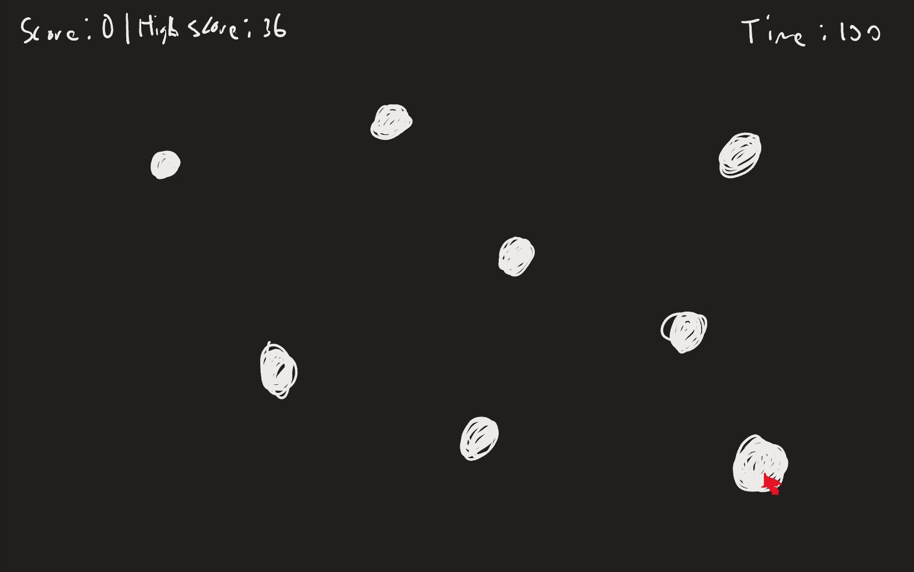
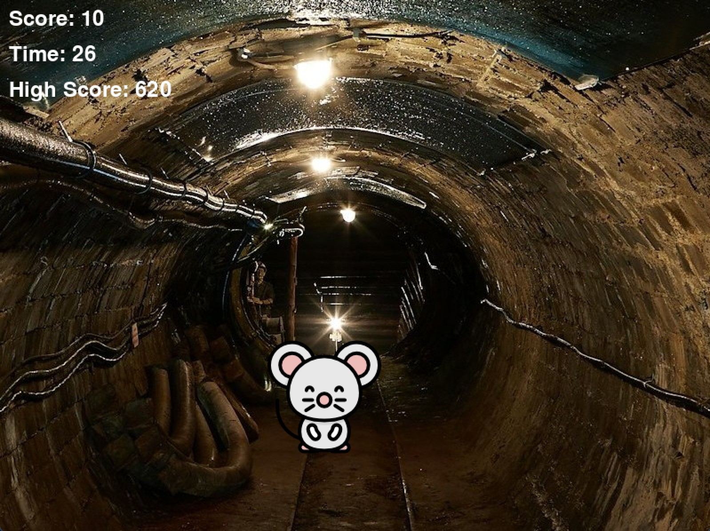

# Roy
## CS110 B1 Final Project Fall 2024

# Target Zero
# Team Member:
1) Roy

# Project Description
Target Zero is an interactive arcade/festival-style game in which players must shoot as many targets as possible within a 30-second time limit. The game features a simple and intuitive interface, allowing players to click on targets to increase their score. The high score is saved between game sessions, motivating players to improve their performance.

# Initial Design

#Final Design

# Program Design - Features
1. Interactive Shooting: Click on randomly appearing targets to score points.
2. Timer Countdown: The game lasts for 30 seconds, with a visible timer display.
3. High Score Tracking: Saves and displays the highest score across sessions.
4. Starting Menu: Displays whether the player wants to play or quit the game.
5. Game Over Screen: Displays the final score when the time runs out.

# Test Case 1: Target Interaction
Description: Verify that clicking a target increases the current score.
Steps:
1) Start the game.
2) Locate a visible target on the screen.
3) Click on the target.
4) Observe the current score.
Expected Outcome: The target disappears, and the current score increases by the appropriate amount.

# Test Case 2: High Score Tracking
Description: Ensure the high score is updated correctly after the game ends.
Steps:
1) Start the game.
2) Play until the game ends (time runs out).
3) Note the final score and verify if it is higher than the previous high score.
4) Restart the game and observe the displayed high score.
Expected Outcome: The high score updates only if the final score is greater than the previous high score.

# Test Case 3: Timer Functionality
Description: Confirm the timer starts and stops correctly during gameplay.
Steps:
1) Start the game.
2) Observe the timer counting down from the specified duration (e.g., 60 seconds).
3) Let the timer reach zero.
Expected Outcome: The timer counts down correctly and ends the game when it reaches zero.

# Test Case 4: Score Reset Between Games
Description: Verify that the current score resets to zero when a new game starts.
Steps:
1) Start the game and play for a few seconds to accumulate points.
2) End the game (let the timer run out).
3) Restart the game and observe the current score.
Expected Outcome: The current score resets to zero at the start of a new game, while the high score remains unchanged.

# Test Case 5: Start Function
Description: Ensure the game pops up a menu before the game starts asking whether the player wants to play or quit
Steps:
1) Open the game.
2) Decide whether or not to play the game or quit
3) If playing, confirm the game runs, if not the game will quit.
Expected Outcome: Game should start if player wants to play and should quit when player doesn't want to play
